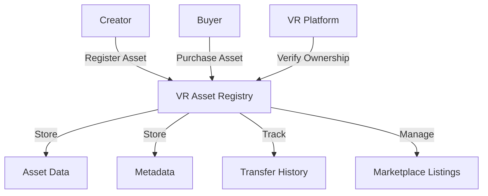

# Cross-Swap

A decentralized cross-chain asset swapping protocol enabling seamless token and asset transfers across different blockchain networks.

## Overview

Cross-Swap provides a trustless infrastructure for cross-chain asset exchanges. It enables users, developers, and platforms to:

- Swap tokens and digital assets across multiple blockchain networks
- Maintain secure and transparent transaction records
- Minimize intermediary risks through smart contract logic
- Support complex multi-chain asset transfers
- Enable interoperability between diverse blockchain ecosystems

## Architecture

The system is built around a central registry contract that handles asset registration, ownership management, and marketplace functionality.



### Core Components
- Asset Registry: Maintains core asset data and ownership
- Metadata Storage: Stores detailed asset information and compatibility data
- Transfer History: Tracks provenance with up to 10 most recent transfers
- Marketplace: Handles listings and secure transactions with royalty distribution

## Contract Documentation

### VR Asset Registry Contract

The main contract managing all VR asset operations.

#### Key Features
- Asset registration with detailed metadata
- Ownership transfers and history tracking
- Marketplace functionality with automated royalties
- Ownership verification for VR platforms
- Metadata update capabilities

#### Access Control
- Asset modifications restricted to current owners
- Creator royalties automatically enforced
- Transfer restrictions configurable per asset

## Getting Started

### Prerequisites
- Clarinet
- Stacks wallet
- STX tokens for transactions

### Basic Usage

1. **Register a new VR asset**
```clarity
(contract-call? .vr-asset-registry register-asset
    "https://metadata.url"
    "Asset Name"
    "Description"
    {x: u100, y: u100, z: u100}
    (list "Platform1" "Platform2")
    "PG"
    "GLB"
    true
    u50)
```

2. **List asset for sale**
```clarity
(contract-call? .vr-asset-registry list-asset-for-sale asset-id price)
```

3. **Purchase asset**
```clarity
(contract-call? .vr-asset-registry purchase-asset asset-id)
```

## Function Reference

### Public Functions

#### Asset Management
- `register-asset`: Create new VR asset registration
- `transfer-asset`: Transfer ownership to another address
- `update-asset-metadata`: Modify asset metadata
- `update-asset-settings`: Update transferability and royalty settings

#### Marketplace
- `list-asset-for-sale`: Create sale listing
- `cancel-asset-listing`: Remove sale listing
- `purchase-asset`: Buy listed asset

### Read-Only Functions
- `get-asset-info`: Retrieve basic asset information
- `get-asset-metadata-by-id`: Get detailed asset metadata
- `get-asset-listing`: View sale listing details
- `get-asset-history`: Access transfer history
- `verify-ownership`: Check current owner

## Development

### Testing
1. Clone the repository
2. Install Clarinet
3. Run tests:
```bash
clarinet test
```

### Local Development
1. Start Clarinet console:
```bash
clarinet console
```
2. Deploy contracts:
```clarity
(contract-call? .vr-asset-registry ...)
```

## Security Considerations

### Limitations
- Transfer history limited to 10 most recent transfers
- Maximum royalty percentage of 50%
- Metadata string length restrictions

### Best Practices
- Verify asset ownership before integration
- Check transferability status before transactions
- Validate metadata URL authenticity
- Handle royalty distributions correctly
- Monitor transfer events for asset tracking